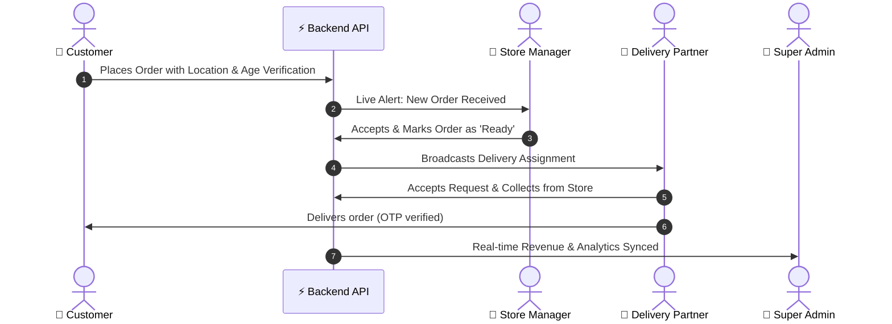

# 🍹 Drinkit — Hyperlocal On-Demand Delivery Platform

[](https://turbo.build/)
[](https://expo.dev/)
[](https://nextjs.org/)
[](https://reactnative.dev/)
[](https://www.typescriptlang.org/)
[](https://www.prisma.io/)

**Drinkit** is an enterprise-grade, high-performance hyperlocal delivery ecosystem (inspired by Blinkit & Swiggy) built for quick-commerce and compliant beverage ordering. It connects customers, store merchants, delivery riders, and administrators in real time.

---

## 🌟 Ecosystem Architecture

The repository is structured as a scalable **Turborepo Monorepo** containing 5 core applications and shared internal packages:

```
drinkit/
├── apps/
│   ├── customer/        # 📱 Customer Mobile App (Android/iOS) + 🌐 Responsive Web Portal (Expo + Web)
│   ├── delivery/        # 🛵 Delivery Partner Rider App (Expo / React Native)
│   ├── store/           # 🏪 Merchant / Store Manager Live Dashboard (Next.js 15)
│   ├── admin/           # 👑 Super Admin Analytics & Platform Control Room (Next.js 15)
│   └── backend/         # ⚡ Central REST API, WebSocket Gateway & DB Service (Node.js/Prisma)
│
├── packages/
│   ├── ui/              # 🎨 Shared Cross-Platform UI Components (Buttons, Modals, Cards)
│   ├── design-system/   # 🌈 Design Tokens, Typography, Elevation & Color Palettes
│   ├── types/           # 📐 Shared TypeScript Definitions (Orders, Users, Stores, Products)
│   ├── api/             # 🔗 Shared API Client SDK
│   ├── utils/           # 🛠️ Shared Helpers & Formatting Utilities
│   └── config/          # ⚙️ Shared Tooling & TSConfigs
│
└── infra/
    └── docker/          # 🐳 Docker Compose for PostgreSQL & Redis
```

---

## 📱 Portals Overview

### 1. 🛍️ Customer Portal (`apps/customer`)
* **Platforms:** Android, iOS, and Web Browsers (Universal React Native Web).
* **Key Features:**
  * Hyperlocal store discovery based on live location.
  * Rich beverage catalog, categories, search, and instant cart management.
  * Age verification & compliance check (21+ age-gate).
  * Seamless checkout and live map order tracking.

### 2. 🏪 Store Manager Portal (`apps/store`)
* **Platform:** Web Dashboard (Optimized for Desktop/POS tablets).
* **Key Features:**
  * Real-time incoming order sound alerts & acceptance workflow.
  * Live inventory & item availability toggling.
  * Order dispatching & handover to assigned delivery partners.

### 3. 🛵 Delivery Rider App (`apps/delivery`)
* **Platform:** Mobile App (Android & iOS).
* **Key Features:**
  * Push notifications for nearby delivery requests.
  * Store pickup navigation and customer drop-off routing.
  * Secure OTP-based delivery confirmation.

### 4. 👑 Super Admin Dashboard (`apps/admin`)
* **Platform:** Web Dashboard.
* **Key Features:**
  * Platform-wide revenue, order volumes, and GMV analytics.
  * Store onboarding, merchant payouts, and commission configuration.
  * User and delivery partner compliance management.

### 5. ⚡ Central Backend Engine (`apps/backend`)
* **Tech:** Fastify/Node.js, PostgreSQL (with PostGIS geo-queries), Redis caching, Prisma ORM.
* **Features:** JWT authentication, geospatial distance calculation, WebSocket live tracking, and secure payment handling.

---

## 🔄 Real-Time Workflow



---

## 🚀 Quick Start & Local Setup

### Prerequisites
* **Node.js**: v18+ or v20+
* **npm** / **pnpm**
* **Docker Desktop** (for local PostgreSQL & Redis)

### 1. Clone & Install Dependencies
```powershell
git clone https://github.com/DhitRaj/drinkit.git
cd drinkit
npm install
```

### 2. Configure Environment Variables
Copy `.env.example` to `.env` in the backend:
```powershell
copy apps\backend\.env.example apps\backend\.env
```

### 3. Start Database (Docker)
```powershell
npm run docker:up
npm run db:generate
```

### 4. Run Applications (Separate Terminals)

| App / Portal | Command | Port / URL |
| :--- | :--- | :--- |
| **Backend API** | `cd apps/backend && npm run dev` | `http://localhost:3000` |
| **Customer App & Web** | `cd apps/customer && npm run dev` | Expo QR / `http://localhost:8081` |
| **Store Dashboard** | `cd apps/store && npm run dev` | `http://localhost:3001` |
| **Admin Dashboard** | `cd apps/admin && npm run dev` | `http://localhost:3002` |
| **Delivery App** | `cd apps/delivery && npm run dev` | Expo QR / `http://localhost:8082` |

---

## 🌐 Deployment & Production

* **Web Applications (Customer Web, Store, Admin):** Deploy directly to [Vercel](https://vercel.com) by connecting your GitHub repository.
* **Mobile Apps (Customer & Rider):** Build production `.apk` / `.aab` / `.ipa` binaries using [Expo Application Services (EAS)](https://expo.dev/eas):
  ```powershell
  cd apps/customer
  eas build -p android --profile production
  ```
* **Backend API & Database:** Deploy to AWS (ECS/EC2), Render, or Railway with a managed PostgreSQL instance.

---

## 📄 License
Private & Proprietary — **Drinkit Platform**. All rights reserved.
