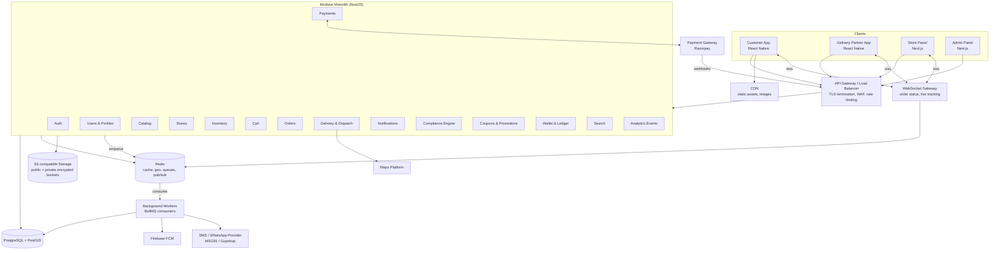

# 13. Backend Architecture

**Document status:** Recommendation. The stack below is a well-supported, hiring-friendly default for an Indian hyperlocal delivery startup. Every choice can be substituted (alternatives are listed) — but the module boundaries, data flows, and operational practices in this document should be preserved regardless of stack.

---

## 1. Recommended Technology Stack

| Layer | Recommendation | Alternatives | Justification |
|---|---|---|---|
| Customer mobile app | **React Native (TypeScript)** | Flutter | One codebase for iOS + Android; largest talent pool in India; shares TS types with backend; OTA updates via CodePush/Expo Updates for fast compliance fixes (e.g., a state changes permitted hours). Flutter is equally valid if the team prefers Dart. |
| Delivery partner app | **React Native** (separate app, shared component library) | Flutter | Same as above. Keep it a separate binary — partner app needs background location, different Play Store data-safety declarations. |
| Store panel & Admin panel | **Next.js 14+ (App Router, TypeScript)** | Remix, Vite + React SPA | Server-side rendering for fast loads on poor store connectivity; file-based routing; easy role-gated layouts; deployable to the same cloud as the API. |
| API backend | **Node.js 20 LTS + NestJS (TypeScript)** | Fastify, Go (Gin/Echo), Django/DRF | NestJS gives enforced module boundaries (critical for the modular-monolith strategy in §4), first-class DI, guards/interceptors for RBAC and audit, built-in WebSocket gateway, and OpenAPI generation. TypeScript end-to-end reduces contract drift with the apps. |
| ORM / DB access | **Prisma** or **TypeORM** + raw SQL for geospatial | Knex, Drizzle | Migrations, type-safe queries; drop to raw SQL for PostGIS queries which ORMs handle poorly. |
| Primary database | **PostgreSQL 15+ with PostGIS** | — (strong recommendation) | ACID for orders/payments/ledger; PostGIS is the industry standard for geofences, serviceability, nearest-partner queries. JSONB covers flexible product attributes. One database technology for MVP = less ops burden. |
| Cache / ephemeral state | **Redis 7** | Valkey, KeyDB | Session/OTP storage, rate limiting, cart cache, live partner locations (GEO commands), dispatch locks, pub/sub for WebSocket fan-out, BullMQ backing store. |
| Message queue / jobs | **BullMQ (Redis-backed)** for MVP; **Kafka/AWS SQS+SNS** at scale | RabbitMQ | BullMQ needs no new infrastructure, supports delayed jobs (dispatch retry, payment timeout), repeatable jobs, and priorities. Move high-volume event streams (location pings, analytics) to Kafka only when justified. |
| Object storage | **S3-compatible** (AWS S3 / Cloudflare R2 / DigitalOcean Spaces) | GCS | Product images, KYC/ID documents (separate **private, encrypted bucket** — see 16_Security), invoices, payout reports. Serve public assets via CDN; private docs via short-lived signed URLs only. |
| Push notifications | **Firebase Cloud Messaging (FCM)** | — | Free, cross-platform, topic + token targeting. APNs is reached through FCM. |
| SMS / WhatsApp / Email | MSG91 or Gupshup (DLT-registered), SES/Postmark | Twilio, Kaleyra | See 18_Notifications. |
| Search | **PostgreSQL full-text + pg_trgm** for MVP → **Meilisearch/Typesense** when catalog > ~20k SKUs or typo-tolerance matters | Elasticsearch | Avoid running Elasticsearch on day one. |
| Maps / geocoding / routing | Google Maps Platform (Places, Geocoding, Distance Matrix) | Ola Maps, MapmyIndia (MapPls) | MapmyIndia/Ola Maps are cheaper for India-only usage and worth evaluating for cost at scale. |
| Payments | Razorpay (primary) — see 17_Payments | Cashfree, PayU | UPI-first, route/escrow product for split settlements. |
| Analytics events | Segment-style event pipe → ClickHouse/BigQuery (post-MVP: start with PostHog self-hosted or Mixpanel) | Amplitude | Keep operational DB out of the analytics query path. |

---

## 2. High-Level Architecture Diagram



---

## 3. Service / Module Breakdown

Each module is a NestJS module with its own controllers, services, repositories, and **owned tables** (no other module writes to them directly — cross-module access is via the module's service interface or domain events).

| Module | Responsibilities | Owns (key tables) | Emits events |
|---|---|---|---|
| **Auth** | OTP send/verify, JWT issue/refresh/revoke, device binding, social login link, session listing, role resolution | `auth_sessions`, `otp_attempts` | `user.logged_in`, `session.revoked` |
| **Users** | Customer profile, addresses, age-verification lifecycle, preferences, DSAR (data export/delete) | `users`, `addresses`, `age_verifications` | `user.registered`, `user.age_verified` |
| **Catalog** | Master product catalog (brand, category, ABV, volume, images), category tree, banners, content moderation of product data | `master_products`, `categories`, `brands`, `banners` | `product.updated` |
| **Stores** | Store onboarding, license documents, staff accounts, operating hours, store status (open/paused) | `stores`, `store_documents`, `store_staff` | `store.status_changed` |
| **Inventory** | Per-store price & stock, low-stock alerts, bulk import, stock reservation on order placement | `store_products` | `stock.low`, `stock.reserved`, `stock.released` |
| **Cart** | Cart CRUD, price recalculation, serviceability + compliance validation on every mutation, cart expiry | `carts`, `cart_items` | — |
| **Orders** | Order creation (from validated cart), state machine, cancellation rules, status history, invoices | `orders`, `order_items`, `order_status_history` | `order.created`, `order.status_changed`, `order.cancelled` |
| **Payments** | Gateway integration, payment intents, webhook processing, reconciliation, refunds | `payments`, `refunds` | `payment.captured`, `payment.failed`, `refund.processed` |
| **Delivery/Dispatch** | Partner duty state, live location ingestion, assignment algorithm, trips, ID-verification-at-doorstep flow, batching | `delivery_partners`, `partner_documents`, `trips`, `trip_events`, `id_verification_logs` | `trip.assigned`, `trip.picked_up`, `trip.delivered`, `trip.failed` |
| **Notifications** | Template registry, channel routing (FCM/SMS/WA/email/in-app), preference center, quiet hours, retries | `notifications`, `notification_templates`, `notification_preferences` | — (consumer of all events) |
| **Compliance** | State rules engine (legal age, permitted hours, dry days, quantity caps), geofence evaluation, order-time compliance gate, audit trail | `states`, `state_rules`, `geofences`, `dry_days` | `compliance.blocked` |
| **Coupons** | Coupon definitions, eligibility evaluation, redemption tracking, abuse limits | `coupons`, `coupon_redemptions` | `coupon.redeemed` |
| **Wallet** | Ledger-based wallet (see 17), promo credits with expiry, referral credits | `wallets`, `wallet_transactions` | `wallet.credited`, `wallet.debited` |
| **Search** | Product/store search, filters, autocomplete, index sync | (search index) | — |
| **Analytics** | Event ingestion endpoint, fan-out to warehouse, ops dashboards data | `analytics_events` (short retention) | — |
| **Admin (cross-cutting)** | Admin CRUD over all modules via their service layers, settlements, payouts, feature flags, audit log viewer | `settlements`, `payouts`, `audit_logs`, `feature_flags`, `support_tickets` | — |

**Golden rule:** every order-affecting write path (cart mutation, checkout, dispatch) must pass through the **Compliance module** before committing. Compliance is a hard dependency, never bypassed by feature code.

---

## 4. Monolith-First vs Microservices

**Recommendation: modular monolith for MVP and well beyond.**

- One deployable NestJS application, one PostgreSQL database, strict module boundaries enforced by lint rules (e.g., `eslint-plugin-boundaries`) and code review.
- Cross-module communication: in-process service calls for synchronous needs; **domain events on BullMQ** for asynchronous needs (notifications, analytics, settlement accrual). This means the event contracts already exist when you later split services.
- Run the same codebase in three roles via env flag: `api` (HTTP), `ws` (WebSocket gateway), `worker` (queue consumers). This gives independent scaling without microservice complexity.

**When to split (extract in this order, only when a trigger fires):**

| Candidate service | Trigger to extract |
|---|---|
| Location ingestion & tracking | Partner location pings exceed what one Node process + Redis comfortably handles (~thousands of pings/sec) |
| Dispatch engine | Assignment computation needs isolated CPU or a different language (e.g., Go) |
| Notifications | Provider fan-out volume interferes with API latency |
| Search | Index size or query volume justifies dedicated Meilisearch cluster (do this first — it's the easiest) |
| Payments/ledger | Compliance/audit isolation requirements, or team ownership boundaries |

Do **not** split by default. A two-pizza team operating 12 microservices will spend its runway on infrastructure.

---

## 5. Real-Time Layer

**Transport:** WebSockets via NestJS gateway (`socket.io` with the Redis adapter so any WS node can deliver to any connected client). Mobile fallback: FCM data messages + polling every 15s when the socket is down.

**Channels (rooms):**

| Room | Subscribers | Events |
|---|---|---|
| `order:{orderId}` | The customer who owns the order | `order.status_changed`, `trip.location`, `trip.eta_updated`, `partner.assigned` |
| `store:{storeId}` | Logged-in store staff | `order.new` (with audible alert), `order.cancelled`, `trip.arrived_for_pickup` |
| `partner:{partnerId}` | The delivery partner | `offer.new`, `offer.expired`, `trip.cancelled`, `duty.forced_off` |
| `admin:ops` | Admin ops dashboard | aggregated order/trip alerts, SLA breaches |

**Live tracking flow:**
1. Partner app sends location every 5–10 s while on an active trip (HTTP batch endpoint or socket event; batch and compress).
2. Server writes to Redis: `GEOADD partners:live {lng} {lat} {partnerId}` + hash with heading/speed/timestamp (TTL 60 s — stale partners drop out of dispatch automatically).
3. Server publishes throttled (max 1/3 s) `trip.location` to `order:{orderId}`.
4. Persist a sparse trail (1 point / 30 s) to `trip_events` for disputes and analytics; do not persist every ping.

**Auth on sockets:** the same short-lived JWT as REST, validated on connect and on room join; server verifies the caller is entitled to the room (customer owns order, staff belongs to store).

---

## 6. Dispatch / Assignment Algorithm

### 6.1 Objectives
Minimize delivery time promise breaches; keep partner idle time low; never assign a trip that violates compliance (e.g., partner not carrying valid partner ID, order outside permitted hours by ETA).

### 6.2 MVP algorithm — scored nearest-available

Trigger: `order.status = READY_FOR_PICKUP` (or `ACCEPTED` for parallel dispatch, configurable per city).

```
1. Candidate set: GEOSEARCH partners:live around store within R (start 3 km)
   filtered by: on_duty, no active trip (or batchable, see 6.3),
   vehicle type OK, not in cooldown, not previously declined this order.
2. Score each candidate:
      score = w1 * eta_to_store            (Distance Matrix or haversine/speed fallback)
            + w2 * idle_time_bonus         (longer idle => better score, fairness)
            + w3 * acceptance_rate
            - w4 * active_batch_penalty
3. Offer to the best candidate: push `offer.new` (socket + FCM data msg),
   with a 30 s expiry held in Redis (`SET offer:{tripId} partnerId NX PX 30000`).
4. On decline/timeout: cooldown that partner for this order, offer next candidate.
5. After N candidates or T minutes: widen R (3 → 5 → 7 km), re-run.
6. After max attempts: raise `dispatch.starved` alert to admin ops; optionally
   broadcast mode (offer to top 3 simultaneously, first-accept-wins via the
   same Redis NX lock).
```

All weights, radii, and timeouts are per-city config in `feature_flags`/config service, tunable without deploy.

### 6.3 Batching (post-MVP)
- Batch only orders from the **same store** with drop-offs within ~1.5 km of each other and combined ETA still inside promise for both.
- Max 2 orders per batch initially. Never batch across stores at MVP.
- Compliance constraint: each drop requires an independent doorstep age/ID verification; batching must not skip it.

### 6.4 Surge & supply balancing
- Compute per-zone demand/supply ratio every minute (orders awaiting dispatch ÷ idle on-duty partners).
- Ratio thresholds trigger: customer-side surge delivery fee (display transparently, cap it), partner-side incentive multiplier, and admin alert.
- Surge state is stored in Redis with zone key; the fee engine (17 §10) reads it at checkout.

### 6.5 Failure handling
- Partner goes offline mid-trip (no ping 120 s): alert ops, attempt contact, auto-reassign if not picked up yet.
- Delivery failure at doorstep (customer fails ID check / intoxicated / unavailable): trip → `RETURN_TO_STORE`, order → `UNDELIVERED_RETURNED`, refund per policy (17 §8), incident logged in `id_verification_logs`.

---

## 7. Geospatial Serviceability & State Rules Engine

Serviceability is a **two-layer check**, executed on: address selection, every cart mutation, checkout, and (re-checked) at dispatch time.

**Layer 1 — Geofence (PostGIS):**
```sql
SELECT g.id, g.store_id, g.state_code
FROM geofences g
WHERE g.is_active
  AND ST_Contains(g.polygon, ST_SetSRID(ST_MakePoint(:lng, :lat), 4326));
```
GiST index on `polygon`. Geofences are drawn per store (delivery zone) and per excise jurisdiction where sub-state rules differ. Result cached in Redis keyed by geohash-6 of the point (TTL 10 min) — nearby requests hit cache.

**Layer 2 — State rules engine (Compliance module):** given `state_code` + timestamp + cart contents + user, evaluate:

| Rule | Source | Effect on failure |
|---|---|---|
| Home delivery permitted in state | `state_rules.delivery_permitted` | Address not serviceable (hard block) |
| Legal drinking age (varies: e.g., 21/23/25 by state; verify with counsel) | `state_rules.legal_age` | Block until age verification passes for that state's age |
| Permitted sale hours (e.g., 10:00–22:00) | `state_rules.permitted_hours` | Block checkout outside window; show next-open time |
| Dry day today | `dry_days` table (state, date) | Block checkout with explanatory message |
| Category restrictions (e.g., country liquor not deliverable) | `state_rules.category_blocklist` (JSONB) | Remove/blocked items in cart |
| Quantity cap per order/day (possession limits) | `state_rules.max_units`, per-category | Cap quantity; block excess |

The engine returns a structured decision `{allowed, violations[], next_allowed_at}` that the API surfaces verbatim to clients — never encode legal rules in the apps.

---

## 8. Caching Strategy

| Data | Store | Key pattern | TTL | Invalidation |
|---|---|---|---|---|
| Serviceability by location | Redis | `svc:{geohash6}` | 10 min | TTL + geofence-change flush |
| State rules | Redis + in-process | `rules:{state}` | 1 h | Explicit bust on admin edit (critical — publish `rules.invalidate`) |
| Catalog: category tree, home layout | Redis | `cat:tree`, `home:{storeId}` | 5–15 min | Bust on admin publish |
| Product detail (merged master + store price/stock) | Redis | `sp:{storeId}:{productId}` | 60 s (stock-bearing → short) | Bust on inventory update |
| Search results (hot queries) | Redis | `srch:{storeId}:{hash(q+filters)}` | 60 s | TTL only |
| Session / JWT denylist | Redis | `sess:{sid}`, `deny:{jti}` | token lifetime | Logout/revoke |
| OTP + attempt counters | Redis | `otp:{phone}` | 5 min | Verify/expiry |
| Partner live locations | Redis GEO | `partners:live` | 60 s per member | Ping refresh |
| Rate-limit counters | Redis | `rl:{route}:{key}` | window | — |
| Dispatch offer locks | Redis | `offer:{tripId}` | 30 s | Accept/decline |

Rules: cache-aside pattern; **never cache anything payment- or ledger-related**; stock shown to users is advisory — the authoritative check is the transactional stock reservation at order creation.

---

## 9. Background Jobs (BullMQ)

| Queue | Jobs | Schedule/Trigger |
|---|---|---|
| `dispatch` | offer partner, offer timeout, radius widening, reassignment | Event + delayed jobs |
| `payments` | payment timeout sweeper (auto-cancel unpaid orders after 12 min), webhook retry processing, daily reconciliation vs gateway report | Delayed + cron 04:00 |
| `notifications` | send push/SMS/WA/email with per-channel retry & backoff | Event-driven |
| `orders` | auto-accept timeout alerts to stores, delivery SLA breach alerts, invoice PDF generation | Delayed |
| `wallet` | promo credit expiry sweep | Cron daily 01:00 |
| `settlements` | accrue order-level settlement entries, generate weekly store/partner payout batches | Event + cron (see 17 §9) |
| `compliance` | dry-day calendar sync, permitted-hours boundary sweep (pause stores at closing time), document expiry reminders (licenses, partner IDs) | Cron |
| `data` | order archival to cold storage, audit log partitioning maintenance, DSAR export/purge jobs, KYC retention purge | Cron nightly |
| `search` | index product/store deltas | Event-driven |

Job hygiene: every job idempotent (keyed by natural ID), max attempts + exponential backoff, dead-letter queue with alerting, per-queue concurrency limits.

---

## 10. Scalability Plan

| Stage | Scale (orders/day) | Actions |
|---|---|---|
| MVP | 0–2k | Single region. 2× API pods, 1× WS pod, 1× worker pod, managed Postgres (2 vCPU) + 1 read replica, managed Redis. Vertical headroom first. |
| Growth | 2k–20k | Horizontal API/WS autoscaling (CPU + p95 latency). Read replicas for catalog/search reads. Move search to Meilisearch. PgBouncer for connection pooling. Partition `orders`, `order_status_history`, `audit_logs`, `trip_events` by month (see 15 §Partitioning). CDN for all catalog media. |
| Scale | 20k+ | Extract location-ingestion and dispatch services. Kafka for location + analytics streams. Consider per-city sharding by `city_id` at the application layer (hyperlocal data is naturally shardable). ClickHouse for analytics. Multi-AZ everything; evaluate second region for DR. |

Postgres-specific: keep hot paths index-covered; ledger and stock updates use `SELECT ... FOR UPDATE` row locks scoped tightly; long-running admin reports go to a replica.

---

## 11. Environments

| Env | Purpose | Data | Third parties |
|---|---|---|---|
| `dev` | Local + shared dev cluster | Seeded synthetic data | Gateway sandbox, FCM dev project, SMS mocked |
| `staging` | Pre-prod, mirrors prod topology | Anonymized subset or synthetic; **never real PII/KYC** | Gateway test mode, real FCM (staging apps), SMS to allowlisted numbers |
| `prod` | Live | Real | Live keys, DLT-approved templates |

Config via environment variables only (12-factor); secrets from a secrets manager (16 §7); per-env Firebase projects and gateway accounts; feature flags gate risky features per city/state.

---

## 12. CI/CD

Pipeline (GitHub Actions or GitLab CI):

1. **PR:** lint + typecheck → unit tests → integration tests (Testcontainers: Postgres+PostGIS, Redis) → build → OpenAPI diff check (breaking-change gate) → SAST + dependency audit (`npm audit`, Semgrep) → secret scan (gitleaks).
2. **Merge to `main`:** build container image (multi-stage, distroless), push to registry, auto-deploy to **staging**, run smoke + critical-path E2E (place order end-to-end against sandbox gateway).
3. **Prod deploy:** manual approval → run DB migrations as a separate gated step (expand/contract pattern — migrations must be backward compatible one release back) → rolling deploy → automated post-deploy smoke → auto-rollback on health-check failure.
4. **Mobile:** separate lanes (Fastlane/EAS): internal track → beta → staged rollout; OTA JS updates for non-native changes.

---

## 13. Observability

- **Logging:** structured JSON (pino), request ID + user ID + order ID correlation propagated through jobs and events. Ship to Loki/CloudWatch/Datadog. **PII redaction at the logger level** (phone, tokens, document numbers) — see 16 §3.
- **Metrics:** Prometheus/OpenTelemetry. RED metrics per route; business metrics: orders created/min, payment success rate, dispatch time p50/p95, offer acceptance rate, delivery promise breach %, compliance blocks/min, webhook lag.
- **Tracing:** OpenTelemetry traces across API → queue → worker; sample 100% of payment and checkout traces, 10% elsewhere.
- **Alerts (PagerDuty/Opsgenie):** payment success rate < 90% (5 min), webhook lag > 2 min, dispatch starvation, DB connections > 80%, queue depth > threshold, p95 checkout latency > 1.5 s, error rate > 2%, cert/secret expiry, compliance-engine failure (**fail closed** — if the rules engine errors, block checkout and page immediately).
- **Uptime & synthetics:** external checks on `/health` (liveness) and `/ready` (dependencies), plus a synthetic order in staging hourly.
- **Crash/error:** Sentry across apps and backend, release-tagged.

---

## 14. Deployment (Managed Cloud)

**Recommendation: AWS (Mumbai, ap-south-1)** — DPDP-friendly data residency in India, richest managed services, gateway/provider proximity. Solid alternatives: GCP (asia-south1), DigitalOcean (BLR1) for a leaner start.

Reference topology (AWS):

- **Compute:** ECS Fargate (or EKS if the team knows K8s) — services: `api`, `ws`, `worker`; Next.js panels on the same cluster or Vercel.
- **Data:** RDS PostgreSQL Multi-AZ with PostGIS, ElastiCache Redis, S3 (two buckets: `public-assets` behind CloudFront; `secure-docs` with SSE-KMS, no public access, VPC endpoint).
- **Edge:** ALB + AWS WAF (rate rules, IP reputation), CloudFront CDN.
- **Ops:** ECR, Secrets Manager, CloudWatch + managed Prometheus/Grafana, Route 53.
- **Network:** private subnets for compute/data; only ALB and CDN public; NAT for egress to gateway/provider APIs.

Cost-lean alternative for pre-seed: DigitalOcean App Platform + Managed Postgres + Managed Redis + Spaces — same architecture, ~⅓ the ops surface; migrate to AWS when compliance/scale demands.

---

## 15. Cross-References

- API contracts: `docs/backend/14_API_Specification.md`
- Schema details: `docs/backend/15_Database_Schema.md`
- Security controls: `docs/backend/16_Security.md`
- Payment/ledger flows: `docs/backend/17_Payments_Wallet_Refunds.md`
- Notification catalog: `docs/backend/18_Notifications.md`
- Regulatory context: `docs/19_Compliance_Legal.md`
